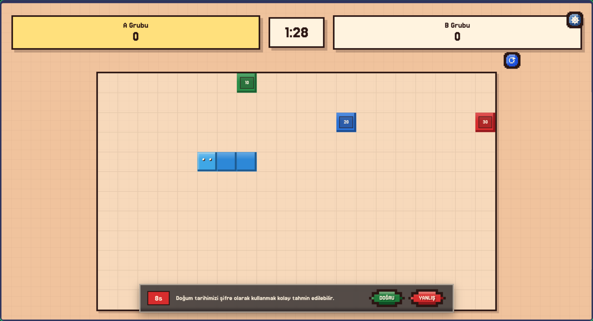
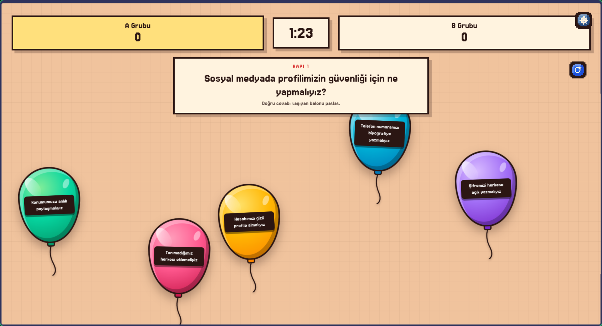
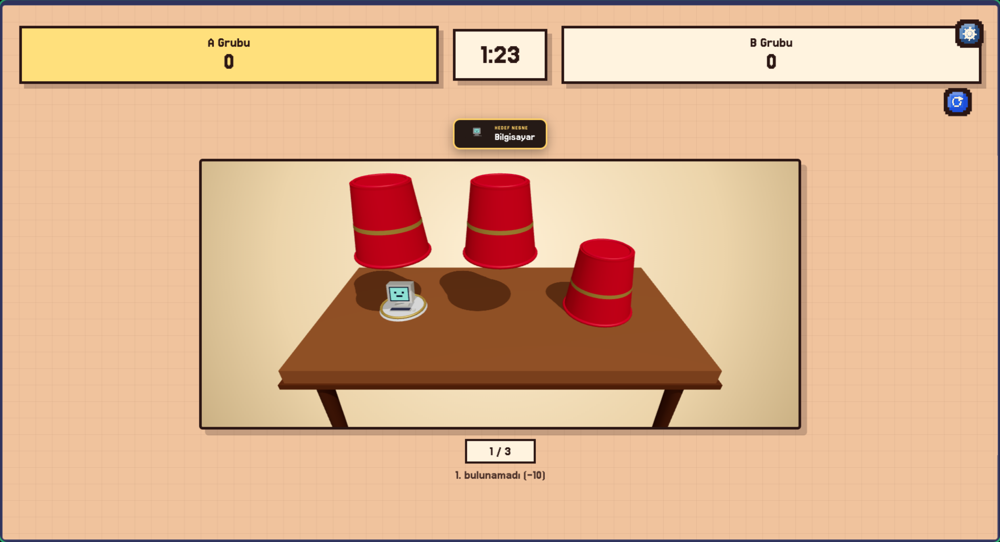
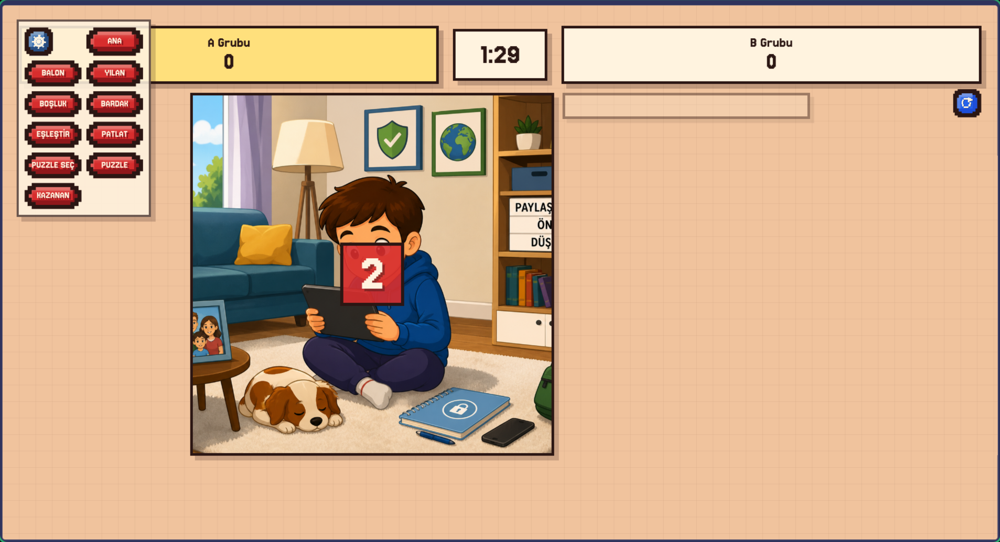
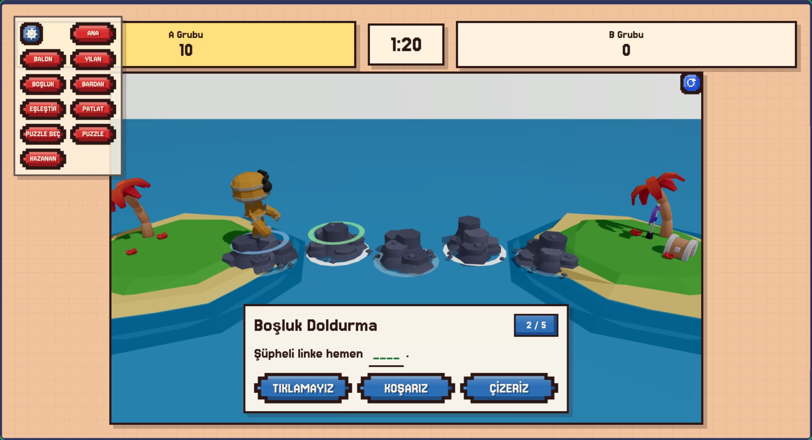
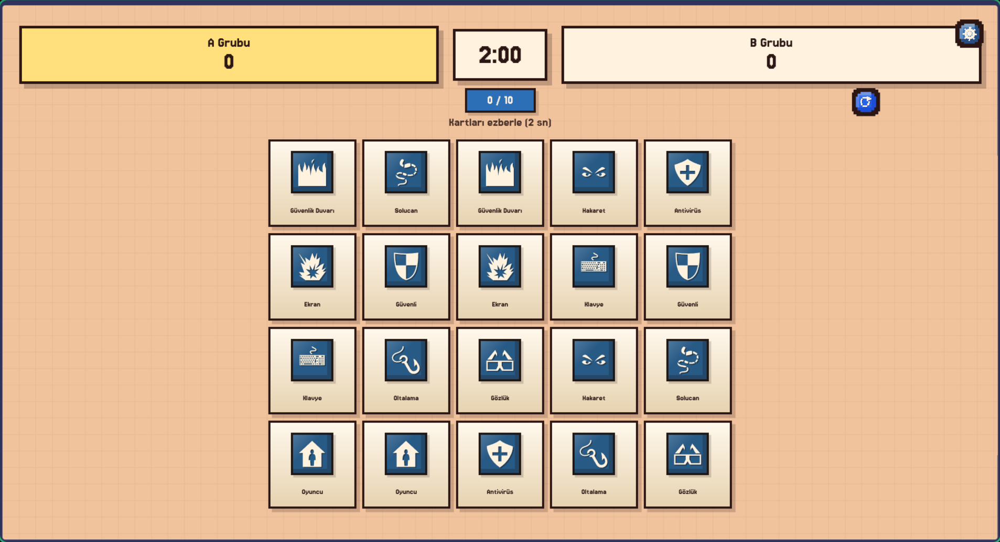
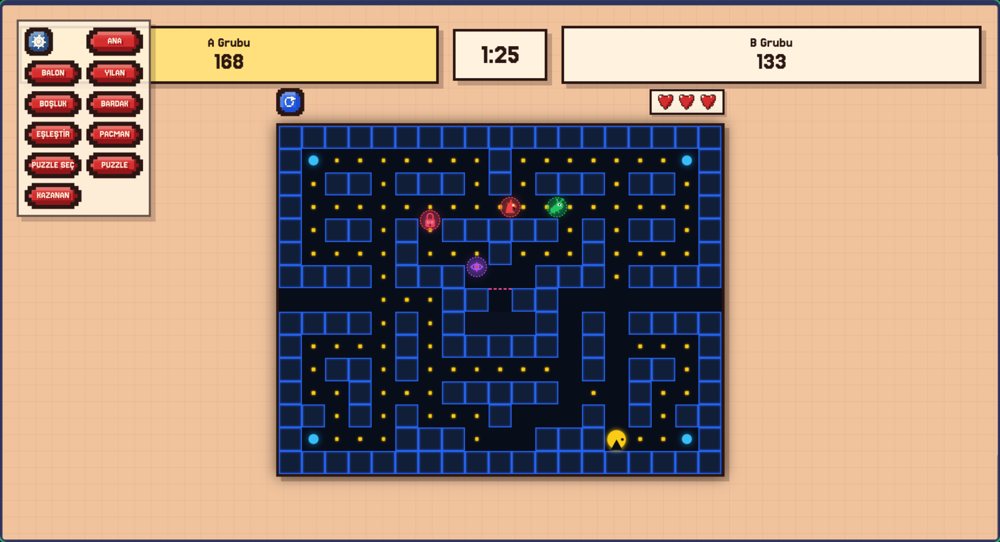

# Dijital Kahramanlar

Dijital Kahramanlar; öğrencilerin güvenli internet kullanımı, siber güvenlik, ekran süresi dengesi ve dijital dünyadaki doğru davranışları eğlenerek öğrenmesi için geliştirilmiş interaktif bir sınıf içi yarışma ve eğitim platformudur.

Okul sınıflarında akıllı tahta kullanımına tam uyumlu olarak tasarlanmıştır. İki takımlı (A Grubu ve B Grubu) rekabet yapısıyla öğrencilerin takım çalışmasını, süreyi verimli kullanmasını ve hızlı karar vermesini destekler.

---

## Hedef Yaş Grubu

Oyunlarımız ve eğitimlerimiz daha çok **9-12 yaş** gruplarını kapsamaktadır. Çünkü bu yaştan küçükler konuları anlayamazken, bu yaştan büyüklerin ise bu içeriklerle dikkatini çekemeyeceğimizi düşünerek çalışmalarımızı bu yaş grubu özelinde gerçekleştirdik.

---

## Oyunlarımız ve Amaçları

### 1. Solucan
Yenen puan değerinde sorunun açıldığı, eğlencenin yanı sıra çocuklara bir şeyler öğretmeyi amaçlayan bir oyundur.



---

### 2. Balon
Sorulan sorunun cevabını ekranda kayan balonlar arasından bulup patlatmayı amaçlayan bir oyundur.



---

### 3. Bardak
Bardağın altındaki bilişim simgesini bulmayı amaçlayan bir oyundur.



---

### 4. Puzzle (Yapboz)
En başta gösterilen görselin parçalarını doğru yerlerine koymayı amaçlayan; el becerisini ve görsel hafızayı destekleyen bir oyundur.



---

### 5. Boşluk Doldurma
Sorudaki boşluğa aşağıda verilen kelimelerden hangisinin uygun olduğunu bularak ilerlenen bir oyundur.



---

### 6. Eşleştirme
Aynı simgelerin nerede olduğunun bulunması gereken, görsel hafızayı güçlendirmeyi amaçlayan bir oyundur.



---

### 7. Pacman (Pekmen)
Pacman karakterini kovalayan virüslerin yer aldığı, daha çok eğlence amaçlı eklenmiş bir oyundur. Sadece ders konularına odaklanmak çocukların dikkatini dağıtabileceği ve ilgilerini kaybetmelerine yol açabileceği için bu durumu önlemek adına eğlenceyi de ihmal etmek istemedik.



---

## Geliştirme ve Çalıştırma

Gereksinimler: Node.js (v18+)

```bash
# Bağımlılıkları yükleme
npm install

# Web geliştirme sunucusu
npm run dev

# Electron masaüstü ortamında çalıştırma
npm run electron

# Üretim derlemesi
npm run build
```
